# 🏛️ High-Level System Architecture — Random League

This document defines the **conceptual building blocks** of the system. It separates concerns into distinct layers to ensure scalability and maintainability.

## 1. System Overview Diagram (Decentralized)

```mermaid
graph TD
    subgraph "📱 Client Device (User's Phone)"
        Client[Mobile App UI]
        LocalStore[Local Cache / State]
    end

    subgraph "☁️ Decentralized Cloud Infrastructure"
        API[🌐 Core API Server]
        DB[(🗄️ Main Database)]
        Auth[🔐 Auth Service]
        
        subgraph "🤖 Automated Workers (Server-Side)"
            Randomizer[🎲 Randomizer Script]
            Scorer[🧮 Scoring Script]
            Scraper1[🕷️ Transfermarkt Bot]
            Scraper2[🕷️ StatsHub/SofaScore Bot]
            Chronicle[📰 Chronicle AI Bot]
        end
    end

    %% Key Concept: The App is thin, the Cloud is heavy
    Client <--> API
    API <--> DB
    API <--> Auth
    
    Randomizer -- " writes new squads " --> DB
    Scorer -- " updates points " --> DB
    Scraper1 -- " injects player data " --> DB
    Scraper2 -- " injects match stats " --> DB
```

---

## 2. Component Blocks (Decentralized)

### 📱 Block A: Client App (The "Thin" Frontend)
**Location**: User's Phone (iOS/Android)
**Responsibility**: Display data and capture user input.
- **Logic is Minimal**: It doesn't calculate points, doesn't scrape websites, and doesn't generate teams.
- **Offline Capable**: Caches the last known state (e.g., your squad) so it works even with spotty internet.
- **Direct Connection**: Only talks to the **Core API**. Never touches the DB or Scrapers directly.

### 🌐 Block B: Core Backend API (The Gateway)
**Location**: Cloud Server (e.g., AWS Lambda, Supabase Edge Functions)
**Responsibility**: Security and Orchestration.
- **Gatekeeper**: Ensures only the admin can trigger a league reset.
- **Validator**: "Is this transfer legal?" (Checks rules on the server, not the phone).

### 🗄️ Block C: Database (The Central Brain)
**Location**: Cloud Database (e.g., PostgreSQL)
**Responsibility**: The single source of truth.
- **Decoupled**: The database exists independently of the app. You could build a web dashboard or a Discord bot later, and they would all read from here.

### 🤖 Block D & E: Independent Workers (The "Bots")
**Location**: Background Workers / CRON Jobs (e.g., GitHub Actions, Railway)
**Responsibility**: Automated tasks that run 24/7 without user intervention.
- **Autonomous**: These scripts wake up, do their job (scrape stats, randomize teams), update the DB, and go back to sleep.
- **Invisible**: Users never see these running. They just see the *results* (updated points) in the app.

### 📰 Block F: Chronicle Bot (The "Journalist")
**Location**: Cloud Function / Scheduled Script
**Responsibility**: Generates content.
- **AI-Powered**: Uses an LLM to read last week's forum drama + match results.
- **Output**: Creates a humorous "Front Page" post on the Forum every Monday.

---

---

---

## 3. Sequence Diagrams (Comprehensive Use Cases)

This section details every major interaction in the system, covering the "League Cycle", "User Actions", and "Back-Office Automations".

### 3.1 League Management
**Use Case 1: Admin Starts a New Round (Randomization)**
*The core loop: wiping teams and assigning new ones.*

```mermaid
sequenceDiagram
    actor Admin
    participant API as 🌐 Core API
    participant DB as 🗄️ Database
    participant Engine as 🎲 Randomizer Bot
    actor User

    Admin->>API: Request "New Round" (via App)
    API->>API: Validate Admin Permissions
    API->>Engine: Trigger Randomizer Job
    activate Engine
    Engine->>DB: Fetch All Users & Active Player Pool
    Engine->>Engine: Run Assignment Logic (No Duplicates, Budget Cap)
    Engine->>DB: Insert new rows into `squads`
    Engine->>API: Send "Round Started" Event
    deactivate Engine
    API->>User: Push Notification: "New Team Ready!"
    User->>API: GET /my-squad
    API-->>User: Returns 15 random players
```

**Use Case 2: Admin Overrides a Score**
*Correction mechanism for data errors.*

### 3.2 Game Lifecycle
**Use Case 3: Matchday Live Scoring**
*How real-world football converts to fantasy points.*

```mermaid
sequenceDiagram
    participant Web as 🌍 Real World
    participant Scraper as 🕷️ Stats Scraper
    participant SC as 🧮 Scoring Engine
    participant DB as 🗄️ Database
    participant API as 🌐 Core API

    loop Every Match Hour
        Scraper->>Web: Fetch Goals/Assists/Cards
        Scraper->>DB: Upsert into `match_stats`
        
        SC->>DB: Read new stats
        SC->>SC: Apply Scoring Rules (Goal=5, etc.)
        SC->>DB: Update `leaderboard` table
        
        opt Significant Change
            SC->>API: Trigger "Rankings Changed" Notification
        end
    end
```

**Use Case 4: Weekly Chronicle Generation**
*The AI journalist reporting on the week.*

### 3.3 User Interactions
**Use Case 5: User Manages Squad**
*Selecting the Starting 11 before the lock.*

```mermaid
sequenceDiagram
    actor User
    participant App as 📱 Client App
    participant API as 🌐 Core API
    participant DB as 🗄️ Database

    User->>App: Drag & Drop Players (4-4-2)
    User->>App: Click "Save Team"
    App->>API: POST /squad/save
    
    API->>DB: Check League Status (Is Locked?)
    alt League is Open
        API->>DB: Update `squad_selection`
        API-->>App: "Saved Successfully"
    else League is Locked
        API-->>App: Error: "Matchday has started!"
    end
```

**Use Case 6: User Posts on Forum**
*Social interaction.*

**Use Case 7: New User Onboarding & Auth**
*Admin adds a colleague + Login flow.*

### 3.4 Data Ingestion & Rankings
**Use Case 8: Player Pool Ingestion (Season Start)**
*Fetching the master list of players.*

```mermaid
sequenceDiagram
    participant TM as 🌍 Transfermarkt
    participant Bot as 🕷️ Player Scraper
    participant DB as 🗄️ Database

    Bot->>TM: Scrape Teams & Players
    Bot->>TM: Extract Market Values
    Bot->>DB: Upsert into `players` table
    Bot->>DB: Log "Ingestion Complete"
```

**Use Case 9: Viewing Rankings**
*User checks the leaderboard.*

**Use Case 10: Social Interaction (Reactions)**
*Liking a post.*

```mermaid
sequenceDiagram
    actor User
    participant API as 🌐 Core API
    participant DB as 🗄️ Database
    participant Author

    User->>API: POST /forum/{post_id}/react {emoji}
    API->>DB: Insert into `reactions` table
    
    par Notify Author
        DB->>API: Trigger Notification
        API->>Author: Push: "User reacted to your post!"
    end
```

**Use Case 11: Admin Management & Moderation**
*Manual control: Lock League & Delete Posts.*

---

## 5. Mapping Requirements to Blocks

| Requirement Area | Handled By |
|------------------|------------|
| **User Mgmt / Auth** | Block B (API) + Block C (DB) |
| **Squad Selection** | Block A (UI) + Block B (Validation) |
| **Forum** | Block A (UI) + Block B (Realtime) |
| **Randomization** | Block D (Game Engine) |
| **Scoring** | Block D (Scoring Engine) + Block E (Stats Scraper) |
| **Market Values** | Block E (Player Scraper) |
| **Weekly Summary** | Block F (Chronicle Bot) |
